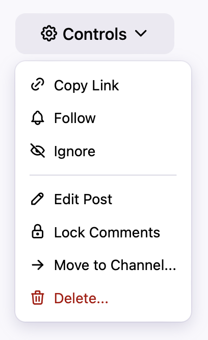

# Actions

Actions are a mechanism for performing tasks on one or more models – for example, deleting comments, or locking a post.

Each item's context menu is really just a list of actions, and extensions can add their own into the mix.

^^^
{width=204 height=333}
^^^ The post controls menu is made up of a list of Actions.
{style="float: right"}

## Defining an Action

To define a new action, extend the `Waterhole\Actions\Action` class. Give your action a `label`, an `icon`, and a `run` method to execute your task on a collection of `$items`:

```php
use Illuminate\Support\Collection;
use Waterhole\Actions\Action;

class Delete extends Action
{
    public function label(Collection $items): string
    {
        return 'Delete';
    }

    public function icon(Collection $items): ?string
    {
        return 'tabler-trash';
    }

    public function run(Collection $items)
    {
        $items->each->delete();

        session()->flash('success', 'Items deleted.');
    }
}
```

### Filtering

Most actions only apply to certain types of items. For example, the Mark as Read action can only be applied to unread posts. To enforce this, implement the `appliesTo` method in your action:

```php
public function appliesTo($item): bool
{
    return $item instanceof Post && $item->isUnread();
}
```

### Authorization

Some actions can only be performed by users with special privileges. To enforce this, implement the `authorize` method in your action:

```php
public function authorize(?User $user, $item): bool
{
    return $user && $user->can('waterhole.moderate', $item);
}
```

> See the [Authorization](./authorization.md) page for more information about how Waterhole's permission system works.

### Confirmation & Input

Some actions may need confirmation or additional input from the user before they are executed. To show a confirmation dialog, return a confirmation message from the `confirm` method. You can customize the "confirm" button text with the `confirmButton` method:

```php
public function confirm(Collection $items)
{
    return 'Are you sure you want to do this?';
}

public function confirmButton(Collection $items): string
{
    return 'Yes';
}
```

You can also return a view from `confirm`, which is useful if you need to collect information to use in the `run` method:

```php
public function confirm(Collection $items)
{
    return view('my-action'); // contains <input name="foo">
}

public function run(Collection $items)
{
    $name = request()->input('foo');

    // ...
}
```

### Destructive Actions

If your action is potentially destructive, set the `$destructive` property to `true` to give the action a special appearance:

```php
public bool $destructive = true;
```

### Responses & Streams

In your action's `run` method, you can optionally return a response, such as a redirect or a file download:

```php
public function run(Collection $items)
{
    return redirect($items[0]->url);
}
```

If you don't return anything, Waterhole will keep the user on the current page. You can stream partial updates to the page by implementing the `stream` method, returning an array of Turbo Streams:

```php
public function stream($item)
{
    return [
        TurboStream::replace(new Components\PostListItem($item)),
    ];
}
```

> See the [Frontend](./frontend.md#turbo-streams) page for more information about how Turbo Streams work.

### Links

Some actions don't actually perform an action at all – they just redirect to another location. A good example is the "edit post" action, which just sends the user to the post's edit route.

For cases like this, do not return a redirect response from the `run` method. Rather, extend the `Waterhole\Actions\Link` class and implement the `url` method:

```php
use Waterhole\Actions\Link;

class EditPost extends Link
{
    // ...

    public function url($item): string
    {
        return $item->edit_url;
    }
}
```

This will render the action as an `<a>` element rather than a `<button>`.

### Conditional Rendering

If you only want your action to render in menus in a certain context (e.g. only in the Control Panel), or you don't want it to render in menus at all (e.g. you want to render it manually in a view), you can implement the `shouldRender` method:

```php
public function shouldRender(Collection $models): bool
{
    return Waterhole::isCpRoute();
}
```

## Registering an Action

Register your action using the [`Actions` extender](reference://Waterhole/Extend/Core/Actions.html) in your service provider:

```php
use Waterhole\Extend;
use Waterhole\Models\Post;

$this->extend(function (Extend\Core\Actions $actions) {
    $actions->for(Post::class)->add(Delete::class);
});
```

## Rendering Action Buttons

Waterhole provides various UI components to render action buttons and menus:

### [Action Button](reference://Waterhole/View/Components/ActionButton.html)

Render a single button that will execute the given action on the given item(s).

```blade
<x-waterhole::action-button
    :action="Acme\Example\Actions\MyAction::class"
    :for="$item"
/>
```

### [Action Buttons](reference://Waterhole/View/Components/ActionButtons.html)

Render all of the actions for the given item(s). If you specify a `limit`, remaining actions will be displayed in an overflow menu.

```blade
<x-waterhole::action-buttons
    :for="$item"
    :button-attributes="['class' => 'btn btn--icon btn--transparent']"
    :limit="3"
    tooltips
/>
```

### [Action Menu](reference://Waterhole/View/Components/ActionMenu.html)

Render a menu button containing all of the actions that apply to the given item(s).

```blade
<x-waterhole::action-menu
    :for="$item"
    placement="bottom-start"
/>
```
