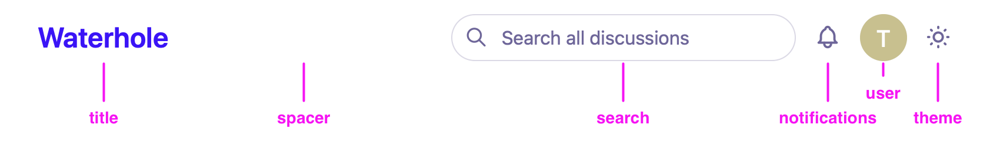

# Customizing The Design

Waterhole features a simple and adaptable design that you can customize and integrate with your brand.

## Custom CSS

Waterhole's [design system](./design/overview.md) makes heavy use of CSS variables and classes, both of which you can override and extend.

New Waterhole projects are already hooked up with a file where you can place custom CSS: `resources/css/waterhole/app.css`. Add your CSS to this file and it will be concatenated onto the end of the main stylesheet bundle.

For example, you can change the accent color of your forum by overriding the `--palette-accent-*` variables (from which the accent color variables are derived):

```css
:root {
    --palette-accent-h: 250;
    --palette-accent-s: 93%;
    --palette-accent-l: 58%;
}
```

> **Tip:** If [debug mode](./configuration.md#debug-mode) is turned off, Waterhole will cache the stylesheet bundle and changes will not be picked up. Run `php artisan waterhole:cache:clear` to flush the cache.

Use your browser's dev tools to inspect elements and their classes and styles to help target your customizations. If you find you're not able to target a specific element reliably, feel free to [report a bug](https://github.com/waterholeforum/core/issues/new) and suggest any missing classes.

You are free to set up a CSS preprocessor (like Sass, LESS, or PostCSS) in your project to compile your custom CSS before it is added to the Waterhole bundle.

Note that you **cannot remove** any of Waterhole's base CSS – you can only build on top of it. This is to make sure that as Waterhole is updated to newer versions with new or changed UI, there are always base styles available to display it properly.

### Dark Mode

Waterhole features a user Dark Mode toggle button in the header. To target changes to CSS variables and classes specifically to light or dark mode, put them within a `[data-theme]` selector:

```css
[data-theme='light'] {
    /* light mode customizations */
}

[data-theme='dark'] {
    /* dark mode customizations */
}
```

If you don't want to support Dark Mode on your forum, you can disable the toggle completely by setting `theme` to either `light` or `dark` in `config/waterhole/design.php`.

## Injecting HTML

Waterhole's HTML is server-rended using [Blade](https://laravel.com/docs/10.x/blade) views and components. Many parts of Waterhole's templates render **dynamic lists of components**. For example, the page header is made up of these components:

^^^
{width=850 height=120}
^^^ The header is made up of an ordered list of components: `title`, `spacer`, `search`, `notifications`, `user`, and `theme`.

Using [extenders](./extending.md#extenders), you can hook into these component lists and add your own components at any position, and replace or remove existing ones. Some common examples are listed below. To learn more about how component lists work, see the [Frontend](./frontend.md#component-lists) page.

### Forum Title

To customize the forum title in the header (for example, to add your logo), use the `Layout` extender's `header` list to replace the default `title` component. Add the following to `app/Providers/WaterholeServiceProvider.php`:

```php
use Waterhole\Extend;

$this->extend(function (Extend\Ui\Layout $layout) {
    $layout->header->replace(key: 'title', content: 'waterhole.title');
});
```

The corresponding view is located at `resources/views/waterhole/title.blade.php`. You can put whatever you want in here – for example, to display an SVG logo:

```blade
<a href="{{ route('waterhole.home') }}" class="row">
    <svg width="30" height="30">
        <title>Acme Inc.</title>
        <circle cx="15" cy="15" r="15"/>
    </svg>
</a>
```

> **Tip:** If you're embedding an `<svg>` like in the example above, it's important to add a `<title>` alternative for screen reader users.

### Document `<head>`

To add custom HTML inside the `<head>` tag, use the `DocumentHead` extender. Add the following to `app/Providers/WaterholeServiceProvider.php`:

```php
use Waterhole\Extend;

$this->extend(function (Extend\Ui\DocumentHead $head) {
    $head->add('waterhole.head');
});
```

This refers to a view located at `resources/views/waterhole/head.blade.php`.

### Site Header

To add a custom site header above Waterhole's header, use the `Layout` extender's `before` list. Add the following to `app/Providers/WaterholeServiceProvider.php`:

```php
use Waterhole\Extend;

$this->extend(function (Extend\Ui\Layout $layout) {
    $layout->before->add('partials.header', position: -10);
});
```

This refers to a view located at `resources/views/partials/header.blade.php`. We also pass a negative `position` parameter to insert our custom header **before** Waterhole's header.

### Hero

You can add a "hero" to your forum's index page to welcome users to your community. Add the following to `app/Providers/WaterholeServiceProvider.php`:

```php
use Waterhole\Extend;

$this->extend(function (Extend\Ui\Layout $layout) {
    $layout->before->add('waterhole.hero', position: 10);
});
```

Your `resources/views/waterhole/hero.blade.php` template might look something like this. The `@if` conditional will make sure it only renders on the index page:

```blade
@if (Request::routeIs('waterhole.home', 'waterhole.channels.show'))
    <section class="section container row justify-center text-center">
        <p class="measure lead">
            Welcome to my community! Please take a look around.
        </p>
    </section>
@endif
```

### Footer

You can add a global footer with copyright information and links. Add the following to `app/Providers/WaterholeServiceProvider.php`:

```php
use Waterhole\Extend;

$this->extend(function (Extend\Ui\Layout $layout) {
    $layout->after->add('waterhole.footer');
});
```

Your `resources/views/waterhole/footer.blade.php` template might look something like this:

```blade
<footer class="section container text-center">
    &copy; {{ date('Y') }} Acme Inc.
</footer>
```

### Other Extenders

Take a look at all of the extenders that are available under the [`Waterhole\Extend` namespace](reference://Waterhole/Extend.html).
