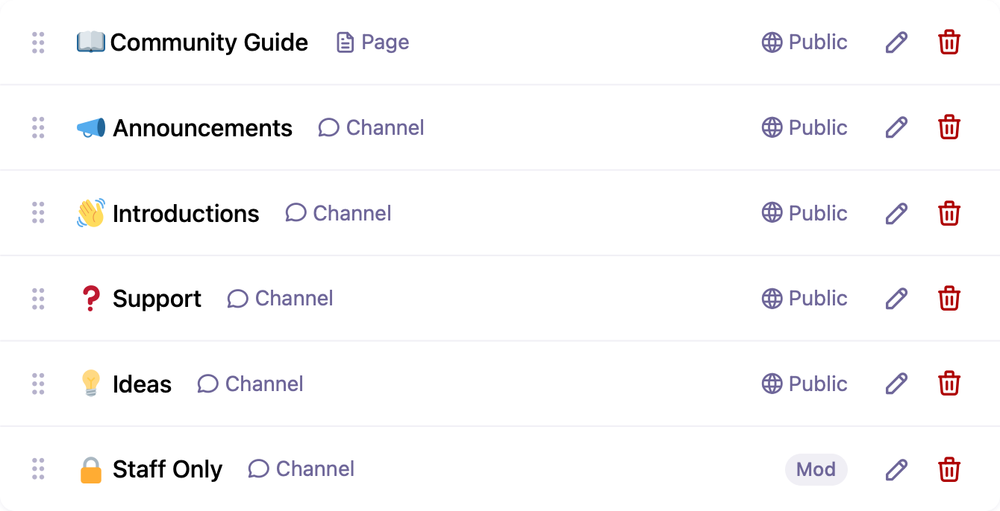

# Structure

Set up the structure of your community with customizable channels, pages, and links.

Your community structure will help users understand what your community is about, navigate it, and categorize and find discussions.

You can manage your community structure in the **Structure** section of the Control Panel. The structure you define will be displayed in the sidebar on your community's homepage, allowing users to easily navigate between sections.

When you install Waterhole, we set up an example structure to get you started. Feel free to keep these, change them, or delete them – you're the boss!

^^^
{width=670 height=343}
^^^ The default structure in a new Waterhole installation, consisting of a page and some channels to get started with.

## Channels

Channels are the areas in your community where discussions take place. In general, it's best to start simple with only a few channels so your users don't get overwhelmed.

### Channel Options

When creating a channel, you will need to choose a name, URL slug, icon, and a short description. There are also a number of additional options available:

- **Ignored by Default** makes the channel opt-in. Its posts will be hidden from the community homepage, so they can only be seen by navigating to the channel. However, users will still be able to individually un-ignore the channel to include its posts on their homepage. This option is useful for more niche channels that only a small number of users will be interested in.

- **Features** allows you to configure various features including whether Answers are enabled, which Taxonomies to use, and which Reaction Sets to use for the channel's posts and comments.

- **Layout** allows you to choose whether posts will display in a compact list, or as expanded cards, when viewing the channel. This is useful for particular channels that are more post-oriented than discussion-oriented – for example, a blog channel.

- **Filters** allows you to override the [global filters](./filters.md) for the channel. The first one will be used as the default.

- **Posting Instructions** allow you to specify more detailed information to be displayed to users when they are creating a post in the channel. This is a good place to remind users about rules and guidelines for posting in the channel – such as information that is required in a support channel.

- **Similar Posts** can be enabled to show the user posts which look similar to the one they are creating.

You can also configure permissions to restrict which [User Groups](./groups.md) can view, post, comment, and moderate (edit and delete content) in the channel.

## Pages

Waterhole allows you to set up basic content pages within your community structure. This is useful for things like Community Guidelines, Terms & Conditions, or a Privacy Policy.

It's a good idea to have a page which lays out what's expected of participants in your community, and gives some pointers about how to navigate and use the community features. For this reason, on a new installation, Waterhole automatically sets up a 📖 **Community Guide** page with a few sensible guidelines to help you get started. You might like to tweak this or start from scratch.

In addition to the content, pages need to be given a name, URL slug, and icon. You can also configure permissions to restrict which [User Groups](./groups.md) can view the page.

## Links

Links allow you to add navigation items that link to external URLs. This could be a link to your homepage, to your social profiles, or to any other website you'd like to be easily accessible. It could even be a link to a specific post in your community!

Like channels and pages, links can have a name, an icon, and permissions to restrict which user groups can view them.

## Headings

Headings are a way to organize your channels, pages, and links. You may not need to use any headings if your structure is nice and simple, but they're there if you do need them.

You can also create a heading with an empty name to just add a blank space between your items.

Visibility permissions on headings aren't necessary, because they automatically get hidden if there are no non-heading items beneath them.

## Unlisted Items

On the Structure page, below the main list of nodes, there is a spot for "unlisted" nodes. Unlisted items will not be shown in the navigation sidebar, and all of the content and posts inside of them will be hidden from search engines. However, they will still be accessible directly by their URL slug.

> **Warning:** Just because an item is unlisted, it doesn't mean it's private. If an unlisted item has open permissions and someone obtains (or guesses) the URL, they will be able to see it. Always ensure your permissions are configured correctly.
